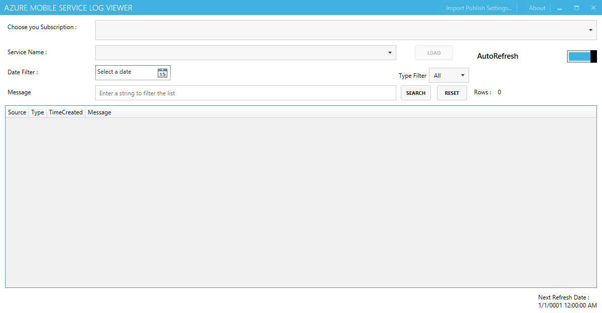
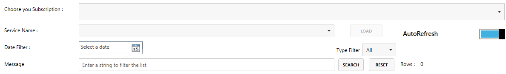
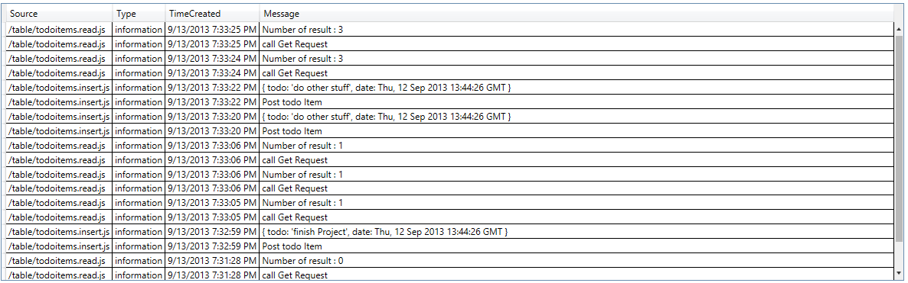

# Project Description

Azure Mobile Service Log Viewer is an application that allow you to download (for offline viewing), read, filter and query the Azure Mobile Log.

# Getting Started

Once the application is installed, you will have : 
* a GUI that allows you to select subscription, mobile service and query log
* a mdf Data that save the log data locally

The application consist of 4 parts :

* First part : the toolbar

The toolbar allow you to import Publish Profile Settings in the application. This will save the Id, Name and Cert use for manage the subscription.

_NB: This is the Subscription Profile Settings, not a publish profile from Azure Web Site_

* Second part : the mobile service selector and the filters

In this part, you will : 

#select the subscription, this will update the Mobile Service Name available for this subscription
#Select the Mobile Service Name, this will call the API to get the log and download them in the Db. If Refresh is activated, the call will be done every minutes to update the view. If not, you have to use the Load Button to refresh the data
#Filter the data using the Date Filter or the Type. These two filters will automatically apply when selected
#You can enter a string in the Text Box and then click on search to apply on the text attribute.
#The number of rows that result for the filter is displayed.
#The button reset allow you to reset the filter Sourire

* Third part : the log viewer
It will show you the log data. You can ordering the column as you like.

* Fourth part : the notification bar

The notification bar display some progress bar and text about the different loading processes and the next update date (in case of automatic refresh)

# Contributors

**Jérémie Devillard**

Jérémie Devillard works as a consultant in France on Microsoft technology since 2008. He is mostly interested in systems integration and Software Oriented Architecture and focuses his effort on Microsoft BizTalk Server. He maintains [a blog](jeremiedevillard.wordpress.com) where you can read his thoughts on various Microsoft-related subjects.

Certifications: Microsoft Certified Technology Specialist (MCTS) BizTalk Server 2006 R2

He has received an [MVP award](https://mvp.microsoft.com/en-us/mvp/Jeremie%20Devillard-4038244) in Connected System Developer Technology in 2012 and was renew as MVP Integration in 2013